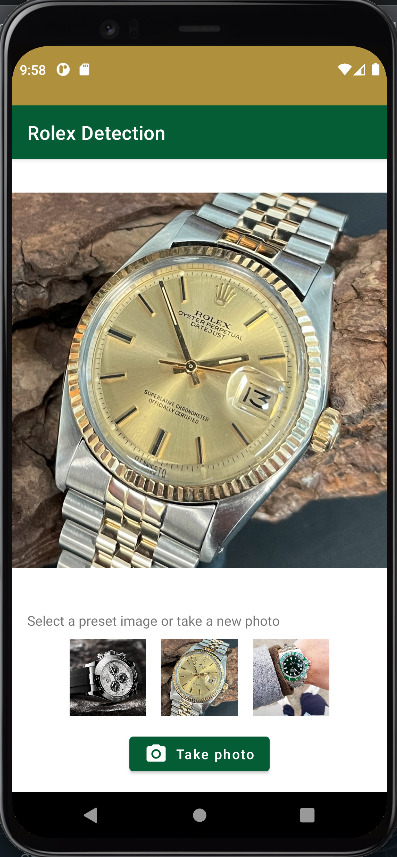
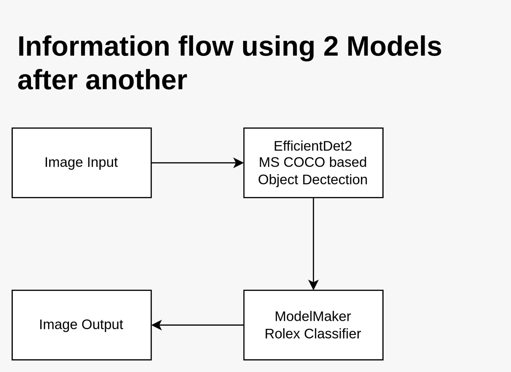

# RolexClassification
Creating an Android App to Classify Rolex Models with Deep Learning using Tensorflow Lite on an Instagram Image-Dataset scraped from Rolex Channel.

Before Inference            |  After Inference
:-------------------------:|:-------------------------:
  |  

## Workflow

We are using two TFLite Models natively embedded in Android sequencially starting with the MS-COCO-2017 based object detector EfficientDet to detect Clocks in an Image and extract it's boundaries. The Image is then cropped by the boundarie boxes and fed into a specificly trained model to classify rolex model.

In the App we made a tradeoff and used [efficientdet-1](https://tfhub.dev/tensorflow/efficientdet/lite1/detection/1) with a slightly worse performance but better response time.

## Instagram Scraping

We used the Python based [instagram-scraper](https://pythonrepo.com/repo/arc298-instagram-scraper-python-third-party-apis-wrappers). We then fed the Images into the same Object Detector to get only Clock Images. We then used different techniques to augment the images in order to increase the number of training samples. The training dataset resides in ./ml/train_ whereas all the scripts used for data preparation reside in ./scraping

## Fitting the Rolex Classifier
We fitted the Rolex Classifier using AutoML within the TFLite Model Maker. The exported Modell therefore includes all the correct TFLite Metadata and can be used conviniently with TFLite Task API for Java/Kotlin.